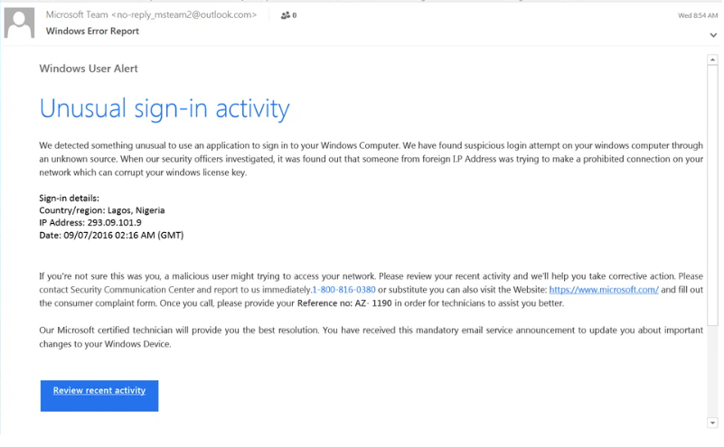

# Task 2 - Phishing Email Analysis Report

##  Sample Email Screenshot

This screenshot is taken from an online site with url - https://www.phishing.org/phishing-examples which usually provides same phishing emails for practioners to practice on.
---

##  Phishing Indicators Identified

1. **Spoofed Sender**: `no-reply_msteam2@outlook.com` (not a Microsoft domain)
2. **Urgent Tone**: "Unusual sign-in", "malicious user", etc.
3. **Invalid IP**: `293.09.101.9` is an impossible IP (max octet is 255).
4. **Geolocation Mismatch**: Sign-in from Lagos, Nigeria used as fear tactic.
5. **Fake Button**: “Review recent activity” may redirect to phishing site.
6. **Grammar Mistakes**: Multiple informal/incorrect phrases used.
7. **Fake Support Number**: “1-800-816-0380” not verified as Microsoft.
8. **Fake URLs**: Text shows microsoft.com, but could link elsewhere.
9. **Suspicious Reference Code**: Generic reference number `AZ-1190`.

---

##  Interview Questions – Model Answers

**1. What is phishing?**  
A cyberattack that deceives individuals into revealing sensitive info.

**2. How to identify a phishing email?**  
Spoofed sender, urgency, suspicious links, grammar issues, etc.

**3. What is email spoofing?**  
Faking an email’s “From” field to appear as a legitimate sender.

**4. Why are phishing emails dangerous?**  
They steal data, infect systems, and cause financial loss.

**5. How can you verify the sender?**  
Check domain, analyze headers, verify via official contact.

**6. Tools for header analysis?**  
MXToolbox, Google Header Analyzer, Mailheader.org.

**7. Actions on suspected phishing?**  
Don't click, report to IT, mark as phishing, block sender.

**8. How does social engineering work in phishing?**  
It manipulates emotions like fear or urgency to trick victims.

---

##  Repo Contents

| File | Description |
|------|-------------|
| `README.md` | Phishing analysis report |
| `email_sample.png` | Screenshot of phishing email |
